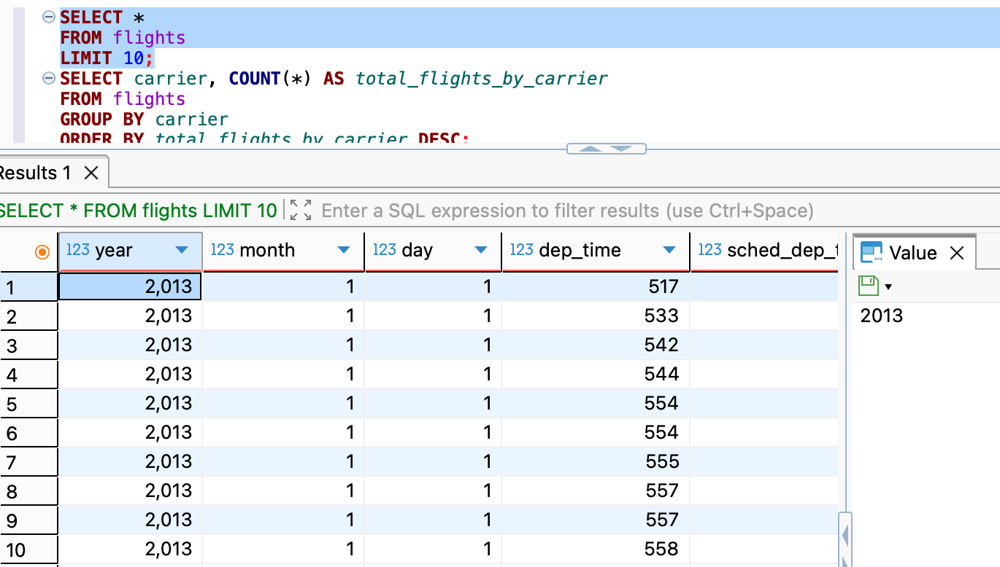
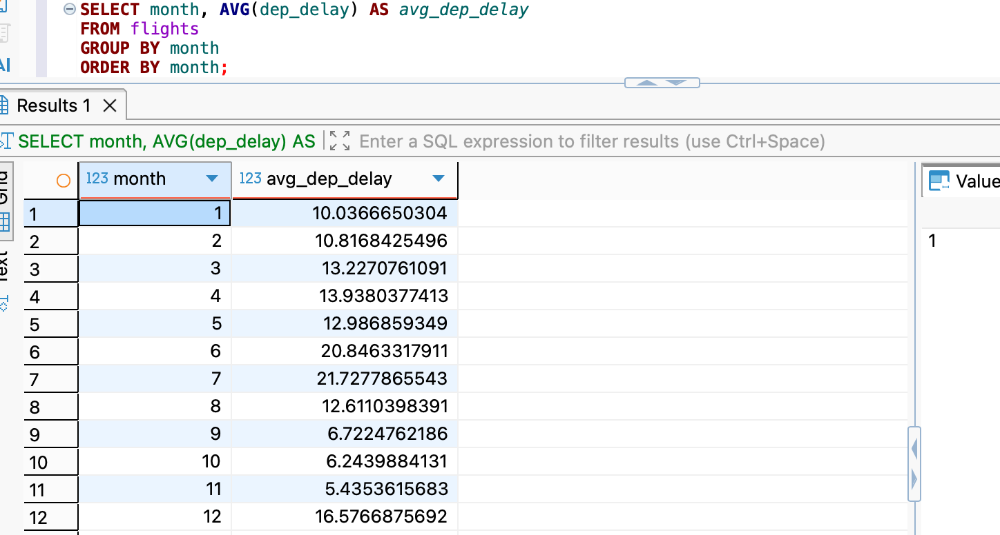
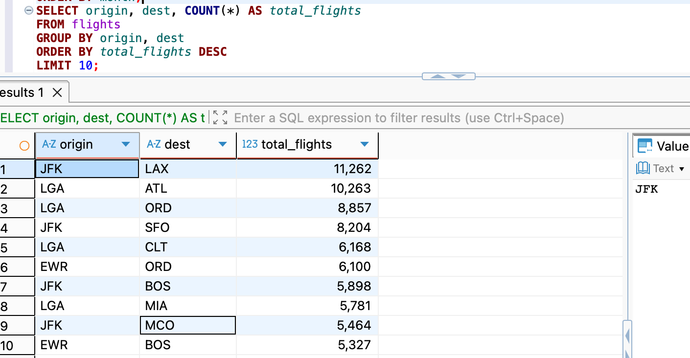

## SetUp

```{r}
#SetUp 

library(DBI)
library(duckdb)
# library(nycflights13)
library(tidyverse)
library(dbplyr)

conn <- dbConnect(duckdb(), "data/flights.duckdb", read_only = TRUE)

dbIsValid(conn)
dbListTables(conn)
dbListFields(conn, "flights")
```

## Part 1a

```{r}
# Part 1a
dbGetQuery(conn, "
SELECT *
FROM flights
LIMIT 10;
")
```

## Part 1b

```{r}
# Part 1b (i)
dbGetQuery(conn, "
SELECT COUNT(*) AS total_flights
FROM flights;
")
```

This query calculates the total number of flights in the dataset using COUNT(\*), which counts all rows in the flights table. The result is stored in a new column called total_flights, providing a quick overview of the dataset size

## Part 1b

```{r}
# Part 1b (ii)
dbGetQuery(conn, "
SELECT carrier, COUNT(*) AS total_flights_by_carrier
FROM flights
GROUP BY carrier
ORDER BY total_flights_by_carrier DESC;
")
```

This query calculates the total number of flights for each carrier. By using GROUP BY carrier, the data is grouped by airline, and COUNT(\*) counts how many flights each carrier operated. The results are sorted in descending order using ORDER BY allowing us to easily identify which carriers have the highest number of flights

## Part 1c

```{r}
# Part 1c
dbGetQuery(conn, "
SELECT AVG(dep_delay) AS avg_dep_delay
FROM flights;
")
```

This query computes the average departure delay across all flights using the AVG(dep_delay) function. The result is returned as a single value in a column named avg_dep_delay , which summarizes overall departure performance in the dataset

## Part 1d

```{r}
# Part 1d
dbGetQuery(conn, "
SELECT dest, COUNT(*) AS total_flights
FROM flights
GROUP BY dest
ORDER BY total_flights DESC
LIMIT 5;
")
```

This query identifies the top 5 most frequent destinations in the dataset. It groups the data by destination using GROUP BY best, counts the number of flights to each destination, and sorts the results in descending order. The LIMIT 5 statement ensures that only the top five destinations with the highest number of flights are displayed.

## Part 1e

```{r}
# Part 1e
avg_delay_by_carrier <- dbGetQuery(conn, "
SELECT carrier, AVG(arr_delay) AS avg_arr_delay
FROM flights
GROUP BY carrier
ORDER BY avg_arr_delay DESC;
")

avg_delay_by_carrier
```

This query calculates the average arrival delay for each carrier. Using GROUP BY carrier , the data is grouped by airline, and AVG(arr_delay) computes the average delay for each group. The results are sorted in descending order to highlight which carriers experience the highest average arrival delays. The output is stored as a table for further analysis

## Disconnect

```{r}
dbDisconnect(conn)
dbIsValid(conn)
```

```{r}
dbDisconnect(conn, shutdown = TRUE)
```

## Part 2

**2a**

{width="199" height="146"}

This query displays the first 10 rows of the flights dataset. It provides a preview of the structure of the data, including variables such as departure time, scheduled departure time, and date information. This helps confirm that the dataset has been loaded correctly.

**2b**

{width="211"}

**2c**

{width="243"}

This query calculates the average departure delay for each month. The results show that delays are generally higher in the summer months, particularly June and July, suggesting seasonal congestion or weather-related disruptions. In contrast, delays are lower in months such as September, October, and November.

**2d**

{width="250"}

This query identifies the most frequent flight routes. The route from JFK to LAX has the highest number of flights, followed by routes such as LGA to ATL and LGA to ORD. This suggests that major hub-to-hub and cross-country routes experience the highest traffic volumes.

**2e**

The results from Part 2b were exported as a CSV file using DBeaver’s export feature. This allows the data to be used outside of the database environment and submitted as part of the assignment.
